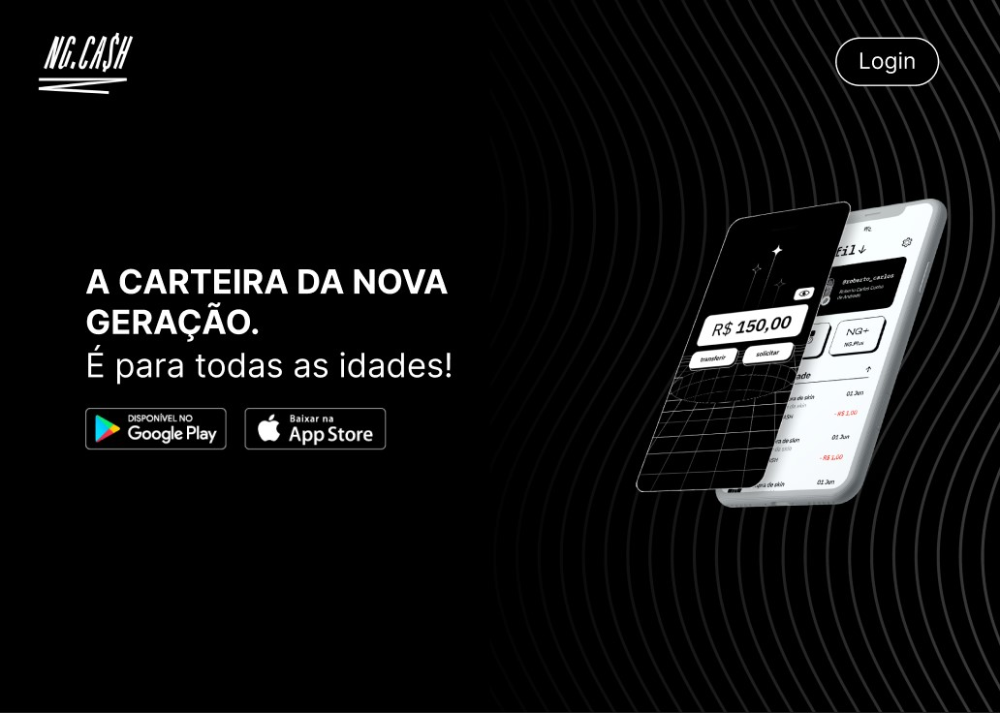
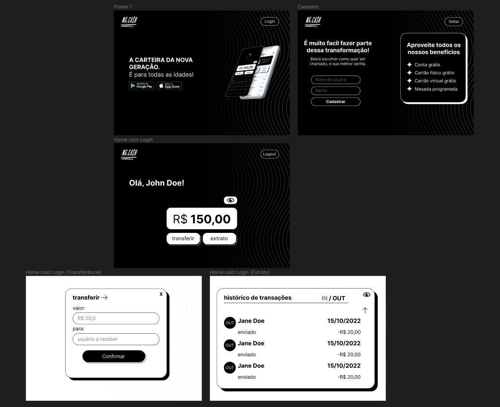

<h1 align="center">
   
</h1>

</br>

## Projeto NG Cash

Este projeto simula algumas funções de um banco digital, como criação de conta e transferências entre contas, também é possivel fazer controle de entradas e saidas dos valores transferidos e ver com quem foi feita a transação.

<br />

---

<br />

## 🚀 Começando

Essas instruções permitirão que você obtenha uma cópia do projeto em operação na sua máquina local para fins de desenvolvimento e teste.

Consulte **[Implantação](#-implanta%C3%A7%C3%A3o)** para saber como implantar o projeto.

<br />

---

<br />

## 📋 Pré-requisitos

Este projeto foi feito usando Node.js, PostgreSQL e Visual Studio Code, se você quiser fazer igual precisará instalar estes programas em sua maquina.


De preferencia para a versão LTS, por ter melhor estabilidade, a versão utilizada neste projeto foi a v18.12.0.

- [Node.js](https://nodejs.org/en/download/)

Aqui escolha qual seu sistema operacional para depois escolher a versão do programa, neste projeto foi utilizada a versão 15.

- [PostgreSQL](https://www.postgresql.org/download/)

Pode instalar a ultima versão do VS Code sem medo.

- [Visual Studio Code](https://code.visualstudio.com)

<br />

---

<br />

## 📦 Implantação

Este é um projeto Fullstack, então temos uma pasta voltada para o Back, onde criamos nossa API, e outra para o Front onde temos toda a construção de nossa pagina. Para rodar este projeto em sua maquina, você pode clonar o projeto ou baixar o arquivo zip aqui pelo GitHub. 

```bash
   # Clonar o repositório
   $ git clone https://github.com/matheus92as/Case-NG.git
```

## BACKEND

Para seu Back funcionar corretamente, será necessario criar antes o seu banco de dados no Postgre, caso tenha duvida de como cria-lo veja este video onde é apresentada a instalação do Postgre e a criação de um banco.

Atenção: As informações do video, até o minuto 7:40 são suficientes para criação do nosso banco.

## [Tutorial para criação de banco](https://youtu.be/L_2l8XTCPAE)

Agora que temos nosso banco pronto é preciso criar a conexão dele com nossa aplicação. Mas antes de tudo precisamos entrar na pasta server e instalar as suas dependências. Podemos abrir o terminal direto dentro da pasta server, ou abrir na pasta principal e depois entrar em server, faça como preferir.

```bash
   # Entrar na pasta do Back
   $ cd server/

   #Instalar bibliotecas já escritas no packaje.json
   $ npm i
```

Ao fazer a instalação de nossas dependências será gerado um arquivo .env, caso isso não aconteça crie você mesmo, pois ali iremos guardar com segurança nossa conexão com o banco de dados. Agora iremos editar alguns arquivos, para isso abra o VS Code e arraste sua pasta do projeto para dentro dele, ou no terminal execute o comando code .

```bash
   # Abrir VS Code
   $ code .
```

A documentação do prisma mostra de forma clara como deve ser feita a conexão. Mas os detalhes que temos que focar são, como esta configurado nosso arquivo schema.prisma, neste caso você já o baixou configurado corretamente neste projeto, também temos que prestar atenção no DATABASE_URL escrito em nosso arquivo .env.

## [Documentação PostgreSQL no Prisma](https://www.prisma.io/docs/concepts/database-connectors/postgresql)

Forma correta de configurar no arquivo schema.prisma

```typescript
datasource db {
  provider = "postgresql"
  url      = env("DATABASE_URL")
}
```

Exemplo de URL do database

<h1 align="center">
   
</h1>


Agora que temos nosso banco de dados criado e nosso Back configurado, vamos rodar o comando quer irá criar nossas tabelas no banco de dados. Quando o terminal perguntar qual o nome da nova migration, pode escrever algo como "Criação de tabelas no banco", ou algo relacionado a isso, esta informação é como um commit no GitHub, onde registramos informações para controle de versões.

```bash
    #Gerar tabelas no banco
    $ npx prisma migrate dev
```

Para verificar se as tabelas foram criadas com sucesso, podemos entrar no nosso banco de dados pelo programa pgAdmin 4 (o Workbench do Postgre), ou rodar um comando próprio do prisma que nos possibilita tem controle facil das nossas informações.

```bash
    #Abrir visualizador do banco no browser
    $ npx prisma studio
```

Se você chegou até aqui com tudo ok, agora só precisamos fazer nosso Back rodar, caso ache necessario pode abrir mais uma guia de terminal em seu VS Code para isso.

Para dividir o teminal use o atalho Ctrl + Shift + 5 dentro do VS Code.

```bash
    #Rodar aplicação Backend
    $ npm run dev
```

<br />

## FRONTEND

Com nosso back rodando podemos acessar nosso banco de dados através das requisões criadas em nossa API pessoal, então agora esta na hora de fazer nossa pagina rodar também. Para isso vamos voltar para a pasta principal pelo terminal e entrar na pasta web.

```bash
    #Voltar para a pasta principal
    $ cd ..

    #Entrar na pasta do Frontend
    $ cd web/
```

Nossa aplicação Front já esta praticamente pronta, agora só precisamos fazer as intalações de dependencias assim como fizemos no back, estando dentro da nossa pasta web executamos nosso comando de instalação.

```bash
   #Instalar bibliotecas já escritas no packaje.json
   $ npm i
```

Então rodamos nosso comando para roda a pagina.

```bash
    #Rodar aplicação Backend
    $ npm run dev
```

Agora que nosso projeto Full esta rodando pleno, podemos fazer alguns testes basicos de usabilidade, inicialmente só podemos nos logar ou criar um novo usuário, então nesse caso teremos que criar um usuário.

Ao clicar no botão Login no topo da pagina iremos ver um card para logar, mas no final dele teremos um link para a pagina de cadastro, é ali que iremos. Agora só nos resta escolher um nome e senha, fiquei atento pois a senha deve conter 8 caracteres e ao menos uma letra maiúscula, e o nome deve ter no minimo 3 letras, caso tente fazer diferente a pagina não ira permitir a criação do usuário.

Com o usuário criado você é redirecionado para a home, mas desta vez podendo visualizar todos os seus dados, como saldo e transferências.

<br />

---

<br />

## 🛠️ Construído com

Estas foram algumas das técnologias utilizadas no projeto, caso precise de referências ou mais detalhes na documentação.

* [Fastify](https://www.fastify.io) - Framework para construção do ecossistema do nosso Back.
* [Prisma](https://www.prisma.io) - ORM para comunicar aplicação back ao banco de dados.
* [Zod](https://www.npmjs.com/package/zod) - Biblioteca para validação de schemas em nosso Back.
* [bcryptjs](https://www.npmjs.com/package/bcryptjs) - Biblioteca responsavel pela geração de Hash nas senhas guardadas no nosso banco de dados.
* [NextJS](https://nextjs.org) - O framework web usado.
* [Axios](https://www.npmjs.com/package/axios) - Usada para consumo da nossa própia API.
* [Styled Components](https://styled-components.com) - Para estilização do nosso Front.
* [Moment](https://momentjs.com) - Biblioteca muito util para conversão de datas, utilizada para manipular dados vindos do Backend.

</br>

---

</br> 

## ✒️ Planejamento

</br>

BACKEND

Inicialmente alguns dados foram passados por briefing pela empresa responsavel do case deste projeto, mas em geral só continha exemplo de estrutura do Backend, então tive quer criar minha estrutura com base nisso, sendo necessaria algumas alterações, como as associações entre as chaves estrangeiras(FK).

Tabela Back do Briefing

<h1 align="center">
   
</h1>

Minha tabela

<h1 align="center">
   
</h1>

</br>

FRONTEND

Para o front só me foram apresantadas informações basicas, nenhum layout pré-definido ou identidade visual base, então fui para o Figma e criei meu próprio esboço, utilizando referências como site da própria empresa e perfil de um de seus Designers.

[Fernando Doti - Designer da NG-CASH](https://fdoti.myportfolio.com/ng-cash-id)

## [Esboço no Figma](https://www.figma.com/file/wzlb2hCqmmHlxTffWR3cra/Untitled?node-id=0%3A1&t=iCee5qo8DI72xfe9-1)

<h1 align="center">
   
</h1>


## 🎁 Expressões de gratidão

* Conte a outras pessoas sobre este projeto 📢;
* Convide alguém da equipe para uma cerveja 🍺;
* Plante uma árvore;
* Beba água.


---
⌨️ com ❤️ por [Matheus Souza](https://gist.github.com/matheus92as) 😊
